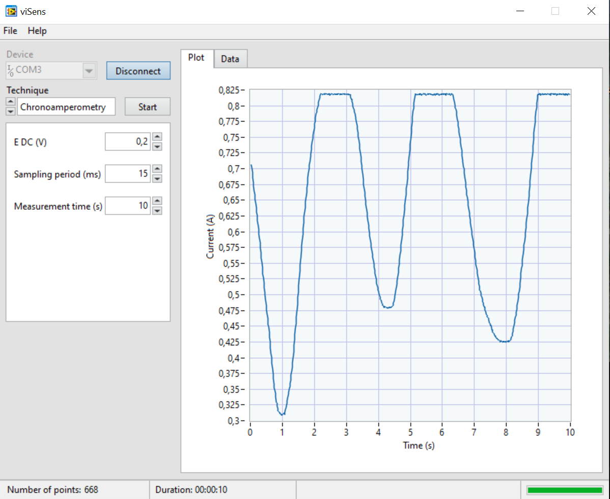

# Proyecto MASB-POT-S

 

> Proyecto desarrollado por: Claudia Aymerich Moreno y Júlia Rey Vilches

[//]: # "Claudia Aymerich Moreno: https://www.linkedin.com/in/claudia-aymerich-moreno-57174a171/"
[//]: # "Júlia Rey Vilches: https://www.linkedin.com/in/j%C3%BAlia-rey-vilches-5272a9180/"

Este informe consiste en la descripción del **proyecto final** realizado para la asignatura  de *Microcontroladores para aplicaciones y sistemas biomédicos* del grado de **Ingeniería Biomédica** de la Universidad de Barcelona. 

El trabajo realizado ha sido desarrollar un **proyecto de programación** de un **potenciostato** para la realización de *voltametrías cíclicas* y *cronoamperometrías* a una muestra de ferrocianuro potásico (K4[Fe(CN)6]) en cloruro de potasio (KCl) a diferentes concentraciones.

 El proyecto se ha desarrollado mediante la programación de la placa de evaluación STM32 Nucleo-F401RE de STMicroelectronics. Basado en el entorno STM32CubeIDE, ha sido realizado en pareja, siguiendo un **flujo de trabajo o workflow en equipo**. La herramienta utilizada ha sido Git, un Sistema de Control de Versiones gratis y *open source*. Los archivos y el proyecto en si ha sido alojados en GitHub mediante el uso de Git.

Este proyecto ha sido desarrollado durante la **primavera de 2020**, durante la pandemia de **Sars-Cov-2**. Por lo tanto, ciertos aspectos del proyecto han estado **limitados** por la **imposibilidad de desarrollar trabajo presencial**, tal y como se indica más adelante.

### Potenciostato

Un potenciostato es un **dispositivo electrónico** requerido para **controlar una cela de tres electrodos** per realizar **experimentos electroquímicos**. Estos tres electrodos son el electrodo de referencia REF, el electrodo de trabajo WE y el electrodo auxiliar AUX (o counter-electrode). Las dos funciones principales de un potenciostato son: 
- **Controlar la diferencia de potencial** entre los electrodos de referencia y de trabajo sin polarizar el electrodo de referencia (impidiendo que pase corriente y evitando así su degradación).

- **Medir la intensidad de corriente** que circula entre los electrodos de trabajo y auxiliar (corriente de la celda).

El potenciostato utilizado en este proyecto está formado por un *front-end* que ha sido específicamente diseñado para la asignatura y un *back-end* que consiste en la *Evaluation Board* (EVB) NUCLEO-F401RE de STMicroelectronics.

### Voltametría cíclica

La [Voltamperometría Cíclica (CV)](https://pubs.acs.org/doi/10.1021/acs.jchemed.7b00361), más conocida como **voltametría cíclica**, es un tipo de **medida electroquímica potenciodinámica** que se utiliza generalmente para estudiar las propiedades electroquímicas de un analito en una solución o de una molécula absorbida sobre un electrodo. El funcionamiento básico de la voltametría cíclica consiste en **aplicar un potencial variable** en una celda electroquímica y **medir la corriente que la celda proporciona**. El potencial entre el electrodo de trabajo y el de referencia varía en el tiempo hasta alcanzar un valor máximo y luego se repite el mismo proceso de manera inversa, hasta alcanzar el valor de potencial inicial. Este proceso se llama **barrido triangular de potencial** y se repite durante un número establecido de **ciclos**. La corriente medida en la celda es representada en función de la tensión aplicada, en forma de *voltamograma cíclico*.

### Cronoamperometría

La [Cronoamperometría (CA)](https://www.sciencedirect.com/topics/chemistry/chronoamperometry) es una **técnica electroquímica** que se utiliza para estudiar la cinética de reacciones químicas y procesos de difusión y absorción características de las especies biológicas en una celda electroquímica. Este proceso consiste en **proporcionar una señal escalón** en el electrodo de trabajo y **medir la corriente** proveniente de la muestra. La corriente de la celda, medida en función del tiempo, fluctúa de acuerdo con la difusión de un analito desde la solución, **cuantificando así la concentración del analito de interés**.  La cronoamperometría puede, por lo tanto, usarse para medir la dependencia entre la corriente y el tiempo actual para el proceso de difusión controlada que ocurre en un electrodo, que varia con la concentración de analito. Una de sus ventajas es que es una técnica sensible que no requiere el etiquetado del analito o biorreceptor. 

Es un método ampliamente utilizado en electroquímica, debido a su relativa facilidad de implementación y análisis, que se aplica en muchos estudios de forma independiente o junto con otras técnicas electroquímicas, como CV. 

### Objetivos

- Programar un potenciostato portable.
- Comunicarse con la aplicación viSens-S instalada con el *host* u ordenador mediante el protocolo MASB-COMM-S.
- Realizar una voltammetría cíclica.
- Realizar una cronoamperometría.

## Contenidos 

- [Introducción](#introducción)
  
  * [Potenciostato](#potentiostat)
  
  - [Voltammetría cíclica](#voltammetría-cíclica)
  - [Cronoamperometría](#cronoamperometría)
  - [Objetivos](#objetivos)
  
- [Workflow en Git](#workflow-en-git)

* [Proyecto](#proyecto)
  * [Diagrama de flujo](#diagrama-de-flujo)
  * [Aplicación de escritorio para el *host*: viSens-S](#aplicación-de-escritorio-para-el-host-visens-s)
  
* [Resultados](#resultados)

- [Conclusión](#conclusión)

### Workflow en Git

La herramienta utilizada para desarrollar el proyecto ha sido [Git](https://es.wikipedia.org/wiki/Git), un **software de control de versiones** ([VCS](https://es.wikipedia.org/wiki/Control_de_versiones)) que permite **administrar los cambios** de diferentes ficheros y **desarrollar trabajos en equipo** coordinando la modificación de archivos compartidos. El proyecto final se ha colgado en la plataforma **GitHub**, que permite **guardar el histórico de proyectos** utilizando el sistema de control de versiones Git. De esta forma, se han podido guardar las versiones de este proyecto tanto en un repositorio local como público. 

El flujo de trabajo o *workflow* utilizado en el proyecto se ha basado en la creación de diferentes ramas, cada una dedicada para una función del potenciostato diferente:

* **Rama master:** rama que contiene el código de producción completo y funcional. 

* **Rama develop:** rama que contiene la agrupación de todos los desarrollos de los miembros del equipo. En esta rama se valida el correcto funcionamiento de todos los elementos que se vuelcan en esta rama. Una vez finalizado, ésta se vuelca en la rama master, donde se presenta el producto final.  En esta rama se ha configurado el `.ioc` y se ha inicializado el código.

* **Rama hotfix/\*\*\*:** : rama que permite la corrección de un *bug* o comportamientos no deseados y que se vuelca en la rama develop.

* **Ramas feature/\*\*\*:** ramas que contienen el desarrollo individual de una funcionalidad. Los asteriscos se sustituyen por el término descriptivo de la funcionalidad desarrollada en esa rama. Este proyecto se ha dividido en las siguientes ramas:
  * *feature/ADC*: rama para la gestión de ADCs.
  
  * *feature/CA_Management*: rama para la gestión de la cronoamperometría.
  
  * *feature/CV_Management* : rama  para la gestión de la voltammetría cíclica. 
  
  * *feature/DAC*: rama para la gestión del DAC. 
  
  * *feature/PMU*: rama para la gestión de la *Power Management Unit*.
  
  * *feature/Setup_Lool_Management* : rama para la creación de las funciones `setup` y `loop`, y modificación de la función `main`. 
  
  * *feature/timers*: rama para la gestión de los *timers*

Todo el vuelco de ramas finalizadas a la rama develop se han hecho mediante *Pull requests*, donde se ha puesto siempre como revisor al otro miembro del equipo con tal de asegurar que se estaba de acuerdo con los cambios propuestos. 

Estos desarrollos se han dividido entre los miembros del trabajo equitativamente. Debido a la pandemia de **Sars-Cov-2**, todas las reuniones, tanto con el equipo como el supervisor, se han desarrollado de manera no presencial. La estructura del código así como las variables y funciones a utilizar han sido decididas por el equipo mediante sesiones virtuales. La corrección de los últimos comportamientos no deseados ha sido realizada mediante el uso de *Skype* y su funcionalidad de *compartir pantalla*.  Finalmente, se han resuelto dudas del proyecto con el supervisor mediante varias reuniones virtuales, a través de *Skype Empresarial*. 

### Proyecto

Se trata de un proyecto muy completo, con gestión de un DAC, de ADCs, de timers, de un módulo de alimentación, de un relé, con comunicación I2C y comunicación UART, así como la gestión de las dos medidas electroquímicas. Las diferentes funcionalidades han sido desarrolladas en funciones implementadas en distintos archivos de código .c con sus respectivas cabeceras. Estas funciones son llamadas cuando son necesarias. El programa principal ha sido desarrollado en un archivo aparte, llamado `stm32main.c` , en la que se han creado las funciones `setup` y `loop` para imitar el funcionamiento de Arduino y evitar ir modificando el archivo `main.c`.

A continuación detallaremos el uso de cada una de las funcionalidades y presentaremos los diagramas de flujo de las funcionalidades más complejas, incluyendo la dinámica principal del programa.

***Power Management Unit (PMU)*** 

Se trata de la unidad de gestión de potencia y se encarga de alimentar el *front-end*. Es deshabilitado por defecto para evitar el consumo de corriente del *front-end* antes de que la EVB negocie el consumo máximo con el controlador USB del ordenador. Cuando el microcontrolador esté alimentado, se habilita la PMU. Esto se realiza llevando en alto el pin `EN` , que ha sido configurado como **salida digital**, nada más se inicie el programa en el microcontrolador. 

La gestión de la PMU se ha realizado mediante el uso de una función, que es llamada en el `setup`. En esta función se implementa la función  `HAL_GPIO_WritePin`.

***Relé*** 

El potenciostato integra un relé, que se encarga de abrir y cerrar el circuito entre el *front-end* y el sensor electroquímico. Por defecto, el relé debe de estar abierto para que estos dos módulos no estén conectados eléctricamente. Al realizar una medición, se debe cerrar el relé y cuando ésta acaba, debe volver a cerrarse. Esto se realiza mediante el pin `RELAY` , que también ha sido configurado como **salida digital**. 

Le gestión del relay no se realiza mediante un archivo con una función aparte. Se implementa directamente mediante la función `HAL_GPIO_WritePin` dentro de las funciones que gestionan la CV y la CA.

***DAC***

Una vez escogidos los parámetros de la medida electroquímica, la **tensión** VCELL debe ser **fijada** en la celda. Esto se realiza mediante el uso de un **Conversor Analógico Digital (DAC)**, que puede generar una tensión de salida de 0 a 4V. A la salida del DAC se ha añadido una etapa para obtener una señal bipolar de -4 a 4V para poder polarizar la celda con tensión positivas y negativas. La correspondencia que se ha usado entre la tensión de la celda deseada VCELL y la tensión de salida del DAC VDAC es la siguiente:

Para esta aplicación, el DAC usado es el **MCP4725**, de *Microchip*. El microcontrolador se comunica con el DAC a través de **comunicación I2C**. Sus especificaciones se encuentran en la siguiente [hoja de datos](https://www.sparkfun.com/datasheets/BreakoutBoards/MCP4725.pdf).

La gestión del DAC ha sido desarrollada en un archivo aparte `dac.c`, junto con su cabecera `dac.h`. En este archivo se ha implementado una función. Ésta integra:

- **Conversión** de la tensión de tipo *double* a *uint16_t* a partir de la **resolución del DAC**. 
- **Separación** de los dos bytes de datos (correspondientes a la tensión) siguiendo el orden especificado en la hoja de datos del DAC (**primero MSB**).
- **Envío** de los datos con la **dirección** del DAC especificada mediante **comunicación I2C**.

***ADCs***

Esta aplicación requiere del uso de un **Conversor Analógico Digital (ADC)** para conocer la tensión de polarización de la celda real, porque pese a que la controlemos, no la podemos dar por conocida. La correspondencia entre la tensión de entrada del ADC VADC y la tensión de la celda VCELL es la siguiente:

La corriente que pasa a través de la celda también se lee a través del ADC, con la correspondencia siguiente:

Las dos tensiones VADC usadas para obtener el valor de VCELL y ICELL provienen de los pines `VREF` y `ICELL`, que han sido configurados como **entradas analógicas**. Su gestión ha sido implementada en un archivo con cabecera aparte. En el archivo `adc.c` se han implementado dos funciones, una para la adquisición del señal proveniente de `VREF`y la otra para el proveniente de `ICELL`. Estas son llamadas des de las funciones CV y CA en su debido momento. Como el microcontrolador solo tiene un ADC, se ha utilizado el *modo escaneo* para leer la señal analógica de dos pines diferentes de manera no simultánea. Para la adquisición de las señales analógicas, se han usado las funciones `HAL_ADC_Start`, `HAL_ADC_PollForConversion` y `HAL_ADC_GetValue`. 

***Comunicación con el host***

Los parámetros para realizar las medidas electroquímicas se indican a través de una **aplicación para el ordenador**, como es explicado en detalle más adelante. La comunicación entre el microcontrolador y el ordenador, el *host*, se realiza mediante **comunicación serie asíncrona** con configuración 115200 8N1. La comunicación es codificada mediante el uso del protocolo [COBS](http://www.stuartcheshire.org/papers/COBSforToN.pdf) (**Consistent Overhead Byte Stuffing**), por su **sencillez y bajo *overhead***, utilizando el carácter `0x00` como *term char*. Cuando el microcontrolador reciba la instrucción de iniciar una medida electroquímica, ésta debe iniciarse inmediatamente. Existen tres instrucciones que se presentan en la siguiente tabla.

| Valor |  Instrucción  | Descripción                                                 |
| :---: | :-----------: | :---------------------------------------------------------- |
| 0x01  | START_CV_MEAS | Pasa los parámetros de una voltametría cíclica y la inicia. |
| 0x02  | START_CA_MEAS | Pasa los parámetros de una cronoamperometría y la inicia.   |
| 0x03  |   STOP_MEAS   | Detiene la medición en curso.                               |

La comunicación se ha gestionada a través de otro archivo .c y su cabecera, llamados `masb_comm_s.c` y `masb_comm_s.h`. 

***Timers***

Se ha utilizado un timer del microcontrolador para controlar con exactitud el tiempo pasado entre muestra y muestra. En un archivo `timers.c` se han implementado dos funciones, una para el periodo de muestreo de la CV y otro para la CA. El timer es preconfigurado mediante STM32MX y en las funciones se cambia el periodo del timer para ponerlo en función del tiempo enviado por el `host`. Además, en ese archivo se implementa la interrupción del timer, que cambia el estado a `TRUE` de una variable de bandera llamada `wait`. Cuando se realiza este cambio, las funciones CV y CA realizaran los pasos y medidas pertinentes, que se indican en los diagramas de flujo que verán más adelante. 

Finalmente, la siguiente tabla muestra un resumen de la configuración de los pines usados para el proyecto.

| Pin  |   Alias   |         Tipo         | Descripción                                                  |
| :--: | :-------: | :------------------: | :----------------------------------------------------------- |
| PA0  |   VREF    |  Entrada analógica   | Tensión absoluta del *Reference Electrode (RE)* VREF utilizada para la medición de VCELL. |
| PA1  |   ICELL   |  Entrada analógica   | Tensión de salida del TIA utilizada para la medición de ICELL. |
| PB8  |    SCK    | I2C (SCK) | Señal SCK del I2C. Con el bus I2C se controla el DAC del *front-end*. |
| PB9  |    SDA    | I2C (SDA) | Señal SDA del I2C. Con el bus I2C se controla el DAC del *front-end*. |
| PA5  |    EN     |    Salida digital    | Señal de (des)habilitación de la PMU. `0`: PMU deshabilitada. `1`: PMU habilitada. |
| PB5  |   RELAY   |    Salida digital    | Señal de control del relé. `0`: Relé abierto. `1`: Relé cerrado. |
| PA2  | USART2_TX |        USART         | Señal de comunicación serie asíncrona para la comunicación con el *host*. |

#### Diagrama de flujo

En este apartado se presenten los diagramas de flujo del funcionamiento principal de la aplicación y de las dos funcionalidades que realizan las medidas de CV y CA.

> Flujo correspondiente a la operativa del usuario con el dispositivo y la aplicación de escritorio instalada en el *host*.

> Flujo correspondiente a la operativa del microcontrolador en función de la instrucción recibida.

> Flujo correspondiente a la operativa del microcontrolador al realizar una voltametría cíclica.

> Flujo correspondiente a la operativa del microcontrolador al realizar una cronoamperometría. 

En estos últimos diagramas se mencionan Vcell y Vcell (real). El real hace referencia a la tensión obtenida con el ADC, es decir, a la tensión real que se aplica a la celda. Por otro lado, Vcell se refiere a la tensión que se fija con el DAC. 

#### Aplicación de escritorio para el *host*: viSens-S

Debido a la **Sars-Cov-2**, el potenciostato programado **no ha podido ser probado en el laboratorio**, con muestras reales. Aun así, **si se ha podido probar la validez del código** desarrollado, gracias a la utilización de la **aplicación de escritorio viSens-S**. Ésta ha sido desarrollada por el supervisor (y cliente).

Esta aplicación permite **elegir los datos de las medidas** electroquímicas y **transmitir los datos desde el ordenador** al microcontrolador, mediante comunicación serie asíncrona (UART). Luego, **grafica los datos** enviados por el microcontrolador después de haber realizado la medida y también **los lista en una tabla**. 

Su funcionamiento es explicado en el siguiente vídeo.

### Resultados

Como se ha indicado anteriormente, debido a la pandemia provocada por el **Sars-Cov-2**,  el código creado para el funcionamiento del potenciostato no se ha podido poner a prueba en el laboratorio. De todos modos, se han podido hacer pruebas mediante la aplicación viSens-S, utilitzando nuestra STM32 Nucleo-F401RE de STMicroelectronics con un potenciómetro. Se ha hecho un divisor de tensión, conectando el variable terminal en las entradas analógicas definidas.  A continuación, se puede ver una imagen de la conexión.

Se tiene que tener en cuenta que para poder realizar el test, se ha comentado el código relativo al DAC, puesto que, como no teníamos el componente físico, el microcontrolador se quedaría congelado y el programa no funcionaría. 

Las siguientes imágenes muestran los datos obtenidos con el potenciómetro conectado al microcontrolador a través de la aplicación viSens-S. Estos tests han servido para **verificar el funcionamiento del código implementado para las dos técnicas comentadas (voltametría cíclica y cronoamperometría) y la conexión entre el *host* (microcontrolador) y la aplicación de escritorio (viSens-S)**.

> Ejemplo de la representación gráfica de los resultados de una cronoamperometría con la aplicación viSens-S.

> Ejemplo de los datos obtenidos de una cronoamperometría con la aplicación viSens-S.

> Ejemplo de la representación gráfica de los resultados de una voltametría cíclica con la aplicación viSens-S.

> Ejemplo de los datos obtenidos de una voltametría cíclica con la aplicación viSens-S.

### Conclusión

Se ha desarrollado la **programación de un potenciostato** para la realización de *voltametrías cíclicas* y *cronoamperometrías*. El proyecto se ha basado en la programación del microcontrolador de la placa de evaluación **STM32 Nucleo-F401RE** de STMicroelectronics, mediante el uso del entorno **STM32CubeIde**. Se ha hecho uso de la herramienta **Git** y de la plataforma **GitHub** para la coordinación del trabajo, que ha sido desarrollado en equipo. 

En este proyecto se han usado muchos conocimientos básicos para la programación de microcontroladores, que han sido adquiridos a lo largo de la asignatura. Se ha hecho uso de periféricos como los **timers** con sus **interrupciones**, de **GPIOs**, de comunicación serie síncrona (**I2C**) y asíncrona (**UART**), de **DACs** y **ADCs**. También se ha visto un **protocolo de codificación** de los datos. 

Este proyecto concluye la asignatura de *Microcontroladores para aplicaciones y sistemas biomédicos*, combinando los aspectos aprendidos a lo largo del semestre. En un semestre, la asignatura nos ha permitido **introducirnos en el extenso mundo de la programación de microcontroladores** de manera muy **práctica**, sin olvidar los **aspectos teóricos fundamentales** y ha despertado en las autoras de este proyecto un **profundo interés por seguir aprendiendo** las entrañas de estos diminutos sistemas inteligentes como son los microcontroladores y todo el campo que les rodea. 

